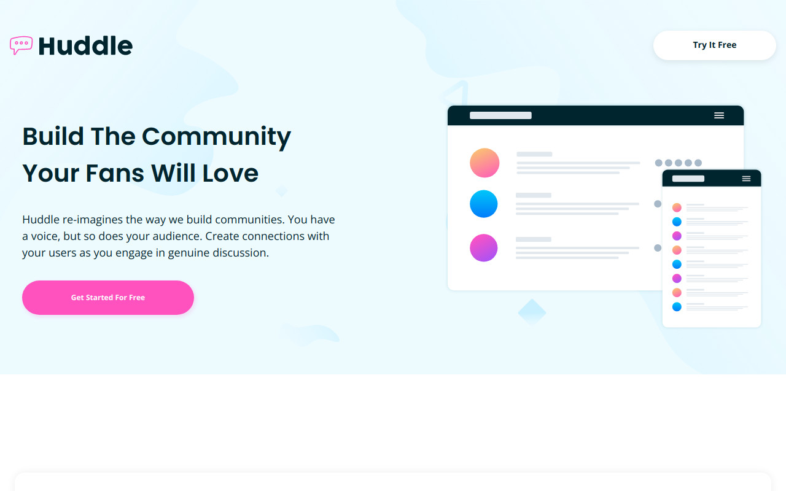

# Frontend Mentor - Huddle landing page with alternating feature blocks solution

This is a solution to the [Huddle landing page with alternating feature blocks challenge on Frontend Mentor](https://www.frontendmentor.io/challenges/huddle-landing-page-with-alternating-feature-blocks-5ca5f5981e82137ec91a5100). Frontend Mentor challenges help you improve your coding skills by building realistic projects. 

## Table of contents

- [Overview](#overview)
  - [The challenge](#the-challenge)
  - [Screenshot](#screenshot)
  - [Links](#links)
- [My process](#my-process)
  - [Built with](#built-with)
  - [What I learned](#what-i-learned)
  - [Continued development](#continued-development)
  - [Useful resources](#useful-resources)
- [Author](#author)

## Overview

### The challenge

Users should be able to:

- View the optimal layout for the site depending on their device's screen size
- See hover states for all interactive elements on the page

### Screenshot

### Links

- Solution URL: [https://www.frontendmentor.io/solutions/huddle-landing-page-with-alternating-feature-blocks-5LlA0Ht2vh](https://www.frontendmentor.io/solutions/huddle-landing-page-with-alternating-feature-blocks-5LlA0Ht2vh)
- Live Site URL: [https://huddle-landing-page-with-alternating-feature-blocks-inky-eight.vercel.app/](https://huddle-landing-page-with-alternating-feature-blocks-inky-eight.vercel.app/)

## My process

### Built with

- Semantic HTML5 markup
- Sass
- Flexbox
- CSS Grid
- Mobile-first workflow
- [React](https://reactjs.org/) - JS library

### What I learned

I learned about the property grid-auto-flow. It allows you to determine the way the cells in a grid arange themselves.

### Continued development

I think I have to be more aware of the accesibility issues regarding anchor tags.

### Useful resources

- [Font Awesome](https://fontawesome.com/) - I have got the social icons from this website.
- [grid-auto-flow](https://css-tricks.com/grid-auto-flow-css-grid-flex-direction-flexbox/) - I styled the links in the footer with this property.
- [Stackoverflow question](https://stackoverflow.com/questions/51683761/how-to-fix-lighthouse-links-do-not-have-a-discernible-name) - I solved an anchor accesibility issue that lighthouse raised with this.

## Author

- Frontend Mentor - [@miguelzaga](https://www.frontendmentor.io/profile/miguelzaga)

